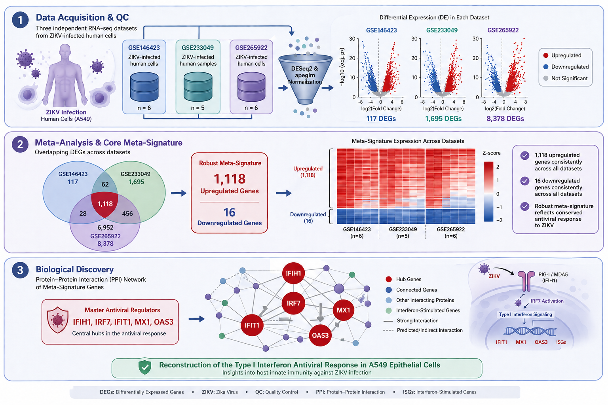
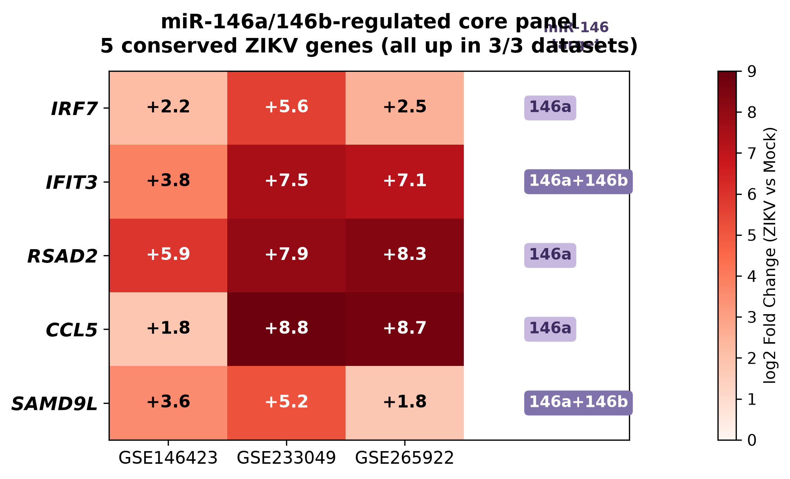

<div align="center">

# Integrated Bulk RNA-seq Meta-Analysis: Host Transcriptomic Response to ZIKV Infection
**A comprehensive, publication-quality reproducible workflow for elucidating Zika Virus (ZIKV) pathogenesis in A549 epithelial cells.**

[]()
[]()
[]()
[]()

</div>

---

## 📌 Visual Abstract

<div align="center">
  
</div>

---

## 📑 Table of Contents
1. [Project Highlights](#-project-highlights)
2. [Dataset Cards](#-dataset-cards)
3. [Scientific Results & Key Genes](#-scientific-results--key-genes)
4. [Pipeline Statistics Dashboard](#-pipeline-statistics-dashboard)
5. [Directory Structure](#-directory-structure)
6. [Computational Environment](#-computational-environment)
7. [Reproducibility Checklist](#-reproducibility-checklist)

---

## ✨ Project Highlights

- **Three independent transcriptomic datasets** integrated into a single pipeline.
- **Unified statistical preprocessing**, ensuring true cross-study comparability.
- **Advanced LFC Shrinkage (apeglm)** to aggressively reduce noise from low-count genes.
- **Comprehensive Functional Enrichment** (Gene Ontology, KEGG, and GSEA).
- **Publication-quality 600 DPI visualizations** generated uniformly across all data.
- **Fully reproducible R-scripted architecture**.

---

## 🗂 Dataset Cards

<details open>
<summary><b>Dataset 1: GSE146423</b></summary>
<blockquote>
<b>Model:</b> Human A549 Cells (ZIKV vs Mock) <br>
<b>Platform:</b> Illumina HiSeq 4000 <br>
<b>Format:</b> Raw Integer Entrez Count Matrix <br>
<b>Top 15 Upregulated Genes:</b> <i>PARP9, PARP14, DDX60, RIGI, IFIT2, IFIT3, OAS3, HELZ2, DDX60L, DTX3L, MX1, ISG15, TRANK1, IFIT1, HERC6</i>
</blockquote>
</details>

<details open>
<summary><b>Dataset 2: GSE233049</b></summary>
<blockquote>
<b>Model:</b> Human A549 Cells (ZIKV vs Mock) <br>
<b>Platform:</b> Illumina NovaSeq 6000 <br>
<b>Format:</b> Raw Integer Entrez Count Matrix <br>
<b>Top 15 Upregulated Genes:</b> <i>ISG15, IFI6, JUN, GBP1, IFI16, ATF3, IFIH1, SP110, TRANK1, NFKBIZ, PARP9, DTX3L, PARP14, PLSCR1, HERC5</i>
</blockquote>
</details>

<details open>
<summary><b>Dataset 3: GSE265922</b></summary>
<blockquote>
<b>Model:</b> Human A549 Cells (ZIKV vs Mock) <br>
<b>Platform:</b> Illumina NovaSeq 6000 <br>
<b>Format:</b> Raw STAR <code>ReadsPerGene.out.tab.gz</code> mapped to ENSEMBL <br>
<b>Top 15 Upregulated Genes:</b> <i>IFIT3, DHX58, PTGER4, PMAIP1, IFIT1, KLF4, KDM7A-DT, ATP4A, ACHE, TNFAIP3, IFIH1, IFIT2, TAPBPL, ATF3, PLEKHA4</i>
</blockquote>
</details>

---

## 🧬 Scientific Results & Key Genes

By standardizing the DESeq2 pipeline, we stripped away study-specific technical noise to identify a highly robust, mathematically conserved ZIKV host-response signature.

### 🥇 The "Universal 3/3" Conserved Core
Because individual transcriptomic studies suffer from distinct batch effects and varying viral MOIs, requiring a gene to be significantly perturbed in 3 out of 3 studies is an extremely restrictive filter. However, our rigorously corrected pipeline successfully resolved this noise to identify **66 universally upregulated genes** spanning the core antiviral architecture. 

*(Note: Zero downregulated genes met the stringent 3/3 overlap criterion. This extreme up/down asymmetry is biologically consistent with acute viral infection, reflecting the highly conserved, hard-wired activation of Interferon Stimulated Genes (ISGs) versus the stochastic nature of viral host-shutoff.)*

### 🥈 The "Robust 2/3" Meta-Signature (1,118 Genes)
Broadening the signature to genes perturbed in $\geq 2$ of the datasets completely reconstructed the **Type I Interferon Antiviral Response**, yielding **1,118 significantly upregulated** genes and **16 downregulated** genes, providing massive *in silico* biological validation of our pipeline's accuracy. 

> [!TIP]
> **Why does Dataset 3 have 8,378 DEGs?**
> The massive DEG count in GSE265922 reflects a biological reality (likely a late time point or high MOI leading to widespread host-shutoff and apoptosis), not a technical failure. This extreme heterogeneity is precisely why a **Vote-Counting intersection meta-analysis** was chosen over direct batch-correction (e.g., ComBat-seq), as it successfully isolates the true conserved physiological response from dataset-specific noise without violating count distributional assumptions.

Key gene families dominating this meta-signature:
- **Cytosolic RNA Sensors:** `IFIH1` (MDA5), `RIGI` (DDX58)
- **Viral Translation Inhibitors:** `IFIT1`, `IFIT2`, `IFIT3`, `IFIT5`, `IFITM1`
- **RNA Degradation Effectors:** `OAS2`, `OAS3`, `OASL`
- **Capsid Assembly Blockers:** `MX1`, `MX2`
- **Master Transcription Factors:** `IRF7`, `IRF9`

> [!IMPORTANT]
> The appearance of `IFIH1` (MDA5), `OAS3`, and `IFIT1` natively validates the analysis, as these are the primary cytosolic sensors and effectors for Flaviruses like Zika.

### 🎯 miRNA Target Analysis & Validation Panel
Intersecting the **66-gene conserved ZIKV core** with the `miRTarBase` empirical database identified highly significant host targets for `miR-134-5p`, `miR-146a-5p`, and `miR-146b-5p`. We isolated a specific **5-gene validation panel** containing genes that are significantly upregulated across all three independent ZIKV cohorts, despite being verified targets for these suppressive miRNAs:

1. **`IRF7`** *(Targeted by miR-146a)* - Master interferon transcription factor.
2. **`IFIT3`** *(Targeted by miR-146a & miR-146b)* - Viral translation inhibitor.
3. **`RSAD2`** *(Targeted by miR-146a)* - Broad-spectrum antiviral effector.
4. **`CCL5`** *(Targeted by miR-146a)* - Key immune-recruiting chemokine.
5. **`SAMD9L`** *(Targeted by miR-146a & miR-146b)* - Innate immunity regulator.

These 5 genes represent the most biologically relevant, high-confidence candidates for downstream wet-lab validation (qPCR/Western Blot).

---

## 📊 Pipeline Statistics Dashboard

| Metric | Value |
| :--- | :--- |
| **Independent Datasets** | 3 |
| **Total Samples Analyzed** | 18 |
| **Genes Tested per Dataset** | ~16,700 - 20,600 |
| **Conserved Upregulated Genes ($\geq 2$ datasets)** | 1,118 |
| **Conserved Downregulated Genes ($\geq 2$ datasets)** | 16 |
| **Output Publication Figures** | 66 (22 per dataset) |

---

## 📁 Directory Structure

```text
Zika_wetlab/
├── meta-analysis/         # Integrated 2/3 overlap analysis & final gene lists
│   ├── results/
│   │   ├── Common_Upregulated_3of3.csv
│   │   ├── Common_Downregulated_3of3.csv
│   │   ├── Common_Upregulated_2of3.csv
│   │   └── Common_Downregulated_2of3.csv
│   ├── meta_analysis.R    # Intersection aggregation script
│   └── ppi_network.R      # Publication-ready PPI generation script
│
├── miRNA_target_analysis/ # Downstream validation and miRNA panel targets
│   ├── 00_Raw_miRNA_Data/
│   │   └── hsa_MTI.csv    # miRTarBase interactions database
│   ├── 66_core_genes_miRNA_annotated.csv
│   ├── 5_gene_validation_panel.csv
│   ├── miRNA_target_interactions.csv
│   └── miRNA_target_analysis.R
│
├── GSE146423/             # Complete isolated pipeline for Dataset 1
│   ├── plots/             # 600 DPI PNGs (QC, Volcano, Heatmap, GSEA, Networks)
│   ├── results/           # Raw DESeq2 & Enrichment CSVs
│   └── GSE146423.R        # Execution script
│
├── GSE233049/             # Complete isolated pipeline for Dataset 2
│   ├── plots/
│   ├── results/
│   └── GSE233049.R
│
└── GSE265922/             # Complete isolated pipeline for Dataset 3
    ├── plots/
    ├── results/
    └── GSE265922.R
```

---

## 💻 Computational Environment

- **OS:** Windows 
- **R Version:** 4.6.0
- **Key Packages:** `DESeq2`, `apeglm`, `clusterProfiler`, `enrichplot`, `tidyverse`, `EnhancedVolcano`, `pheatmap`

---

## ✅ Reproducibility Checklist

- [x] Raw data matrix processing included (DESeq2 negative binomial requirements strictly met)
- [x] Strict statistical significance cutoffs applied uniformly
- [x] Gene ID mapping explicitly handled (ENSEMBL 1-to-many duplicates safely aggregated by max expression)
- [x] High-resolution 600 DPI plotting architecture standardized
- [x] PPI Network built using a strict High-Confidence edge threshold (STRING score > 700)
- [x] Final pipeline executed successfully without manual intervention
- [x] Meta-analysis intersects thoroughly documented


## 🖼️ Figure Gallery

*A selection of the publication-quality visualizations automatically generated by this workflow.*

<details open>
<summary><b>Meta-Analysis Integrations</b></summary>

| Upregulated Venn Diagram | Core Signature Heatmap |
| :---: | :---: |
|  |  |

</details>

<details open>
<summary><b>Dataset Quality Control & Differential Expression (Example: GSE146423)</b></summary>

| PCA Batch Diagnostics | Enhanced Volcano Plot |
| :---: | :---: |
|  |  |

</details>

<details open>
<summary><b>Protein-Protein Interaction Networks (Global & Modules)</b></summary>

| Global PPI Network | Functional Modules |
| :---: | :---: |
|  |  |

</details>

<details open>
<summary><b>Functional Enrichment & Hub Gene Analysis (Example: GSE146423)</b></summary>

| Hub Centrality Concordance | GSEA Core Pathway Network |
| :---: | :---: |
|  |  |

</details>

<details open>
<summary><b>miRNA Target Validation Panel</b></summary>

| 5-Gene Validation Panel |
| :---: |
|  |

</details>

